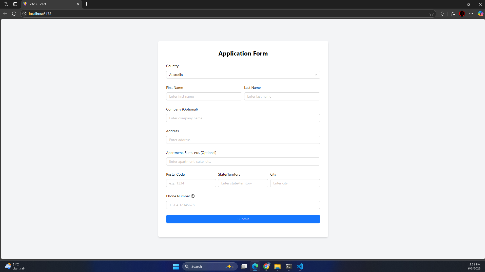
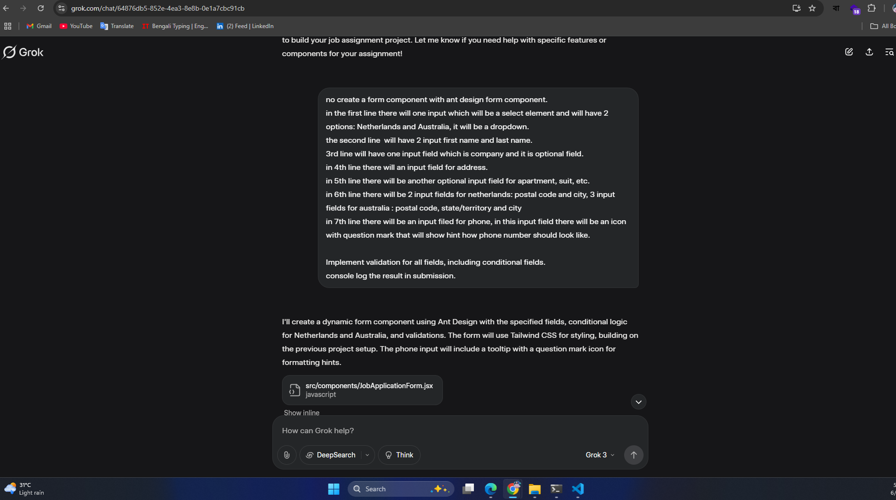

Setup Instructions

To run the project locally, follow these steps:

Clone the Repository:

git clone https://github.com/AbhikThosan/elegance-form.git

cd elegance-form

Install Dependencies:

npm install

Run the Development Server:

npm run dev

Open the Application:

Navigate to http://localhost:5173 in your browser.

Screenshots:

Form:

Prompt:

